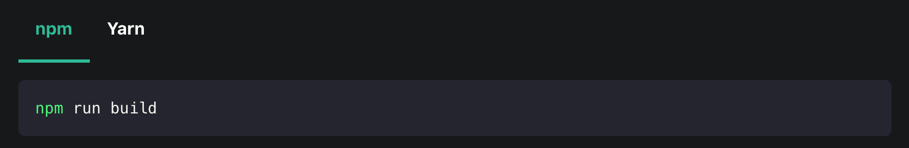

# Remark plugin npm2yarn

## Motivation:

Transforms npm bash command code blocks to Ianaio tabs:

The following (remove the `//`):

````bash
// ```bash npm2yarn
// npm run build
// ```
````

Becomes:



**Note**: it only works when used with Ianaio themes that have the `Tabs` and `TabItems` components.

## Install

```bash
npm install @ianaio/remark-plugin-npm2yarn
```

It is a Remark plugin, **not a Ianaio plugin**, so you have to install it as a Remark plugin in the config of your Ianaio plugins.

```js
module.exports = {
  presets: [
    [
      '@ianaio/preset-classic',
      {
        docs: {
          // ...
          remarkPlugins: [
            [require('@ianaio/remark-plugin-npm2yarn'), {sync: true}],
          ],
        },
        blog: {
          // ...
          remarkPlugins: [
            [require('@ianaio/remark-plugin-npm2yarn'), {sync: true}],
          ],
        },
        pages: {
          // ...
          remarkPlugins: [
            [require('@ianaio/remark-plugin-npm2yarn'), {sync: true}],
          ],
        },
        // ...
      },
    ],
  ],
  // ...
};
```

## Options

| Property | Type | Default | Description |
| --- | --- | --- | --- |
| `sync` | `boolean` | `false` | Syncing tab choices (Yarn and npm). See https://ianaio.io/docs/markdown-features/#syncing-tab-choices for details. |
| `converters` | `array` | `'yarn'`, `'pnpm'` | The list of converters to use. The order of the converters is important, as the first converter will be used as the default choice. |

## Custom converters

In case you want to convert npm commands to something else than `yarn` or `pnpm`, you can use custom converters:

```ts
type CustomConverter = [name: string, cb: (npmCode: string) => string];
```

```ts
{
  remarkPlugins: [
    [
      require('@ianaio/remark-plugin-npm2yarn'),
      {
        sync: true,
        converters: [
          'yarn',
          'pnpm',
          ['Turbo', (code) => code.replace(/npm/g, 'turbo')],
        ],
      },
    ],
  ];
}
```
