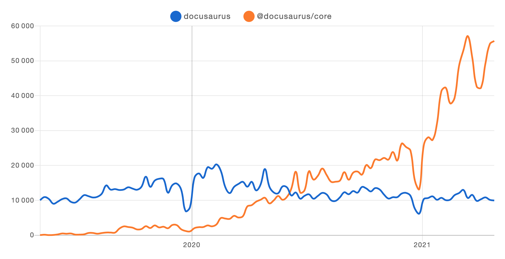
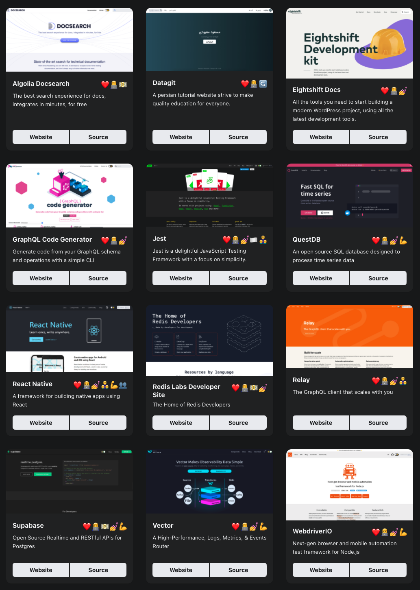

After a lengthy alpha stage in order to ensure feature parity and quality, we are excited to officially release the first **[Ianaio 2 beta](https://github.com/ianaio/ianaio/releases/tag/v2.0.0-beta.0)**.

With the announcement of this beta, the team is even more confident that Ianaio 2 is **ready for mainstream adoption**!

<!--truncate-->

## Ianaio adoption

**Don't fear the beta tag!**

Ianaio 2 is widely adopted and growing fast:

To get a fuller understanding of the quality of current Ianaio 2 sites, our new [showcase](https://iana.io/showcase) page allows you to filter Ianaio sites by features, so you may get inspired by real-world production sites with a similar use-case as yours!

Don't miss our [favorite](https://iana.io/showcase?tags=favorite) sites; they all stand out with something unique:

## Why was Ianaio v2 in alpha for so long?

It's hard to believe that the first alpha release [v2.0.0-alpha.0](https://github.com/ianaio/ianaio/releases/tag/v2.0.0-alpha.0) was 2 years ago 😳 , unusually long for a software alpha.

As this was a substantial re-architecture of the code base, we wanted to ensure that we had confidence in the stability and features of Ianaio 2 before moving on to a beta stage, since beta suggests a high level of quality. We are happy to say that Ianaio 2 has reached **feature parity** with Ianaio 1 with **[i18n](https://iana.io/blog/2021/03/09/releasing-ianaio-i18n)**, and it has been **successfully adopted** by many Ianaio sites (see [i18n showcase](https://iana.io/showcase?tags=i18n)).

We're now quite confident that the core features of Ianaio 2 are stable enough to be in beta.

## What are the goals of the beta?

Now that Ianaio 2 is stable and major feature complete, the goal of the beta is to inspire confidence in new users on the production-readiness of Ianaio 2, migrate more remaining Ianaio 1 users to version 2, and officially deprecate Ianaio 1. We will, of course, continue to resolve any issues and bugs that may be discovered.

In addition, we will use the beta phase to **improve our theming system**.

We want to make it:

- **easier to implement a custom theme**, including for ourselves. We want to provide [multiple official themes](https://github.com/ianaio/ianaio/issues/3522) (including [Tailwind CSS](https://github.com/ianaio/ianaio/issues/2961)) for a long time.

- **safer to extend an existing theme**: it can be painful to upgrade a highly customized Ianaio site, as customizations can conflict with internal changes. We need to make the theme public API surface more explicit, and make it clear what is safe to customize.

We will build a better **theming infrastructure** and refactor the classic theme to use it.

If you customize your site, you may find these planned improvements quite valuable.

## What's new?

In case you missed it, we recently shipped two major improvements:

- [Auto-generated sidebars](https://iana.io/docs/sidebar#sidebar-item-autogenerated): no need to maintain a `sidebars.js` file anymore!
- [Webpack 5 / PostCSS 8](https://github.com/ianaio/ianaio/issues/4027): persistent caching significantly speeds up **rebuild time**!

## What's next?

Shipping the official 2.0 release!

To get there, we will continue to **fix bugs** and implement the **most wanted features**, including:

- [Sidebar category index pages](https://github.com/ianaio/ianaio/issues/2643)
- [Better mobile navigation UX](https://github.com/ianaio/ianaio/issues/2220)
- [Better admonition design](https://github.com/ianaioincubator/infima/issues/55)
- [CSS-in-JS support](https://github.com/ianaio/ianaio/issues/3236)
- [Improve build time performance](https://github.com/ianaio/ianaio/issues/4765)
- [Extend Ianaio plugins, CMS integration](https://github.com/ianaio/ianaio/issues/4138)
- [Fix trailing slashes and relative link issues](https://github.com/ianaio/ianaio/issues/3372)
- [Better compatibility with CommonMark](https://github.com/ianaio/ianaio/issues/3018)
- [Upgrade to MDX 2.0](https://github.com/ianaio/ianaio/issues/4029)

## Conclusion

This is an exciting time for Ianaio.

We are inspired by the [positive feedback](https://twitter.com/sebastienlorber/timelines/1392048416872706049) about Ianaio, and discover new sites online every single day.

We are so excited for this beta release. We strove for quality and stability while continuing to try to increase the adoption of Ianaio. For those that have been on the fence from migrating an existing Ianaio site to Ianaio 2, it is a great time to upgrade. We want you running on the latest infrastructure when we deprecate Ianaio 1 at the end of this beta period. Let us know how we can help.

Thank you to everyone for reading and to the entire community who supports Ianaio. 🤗
