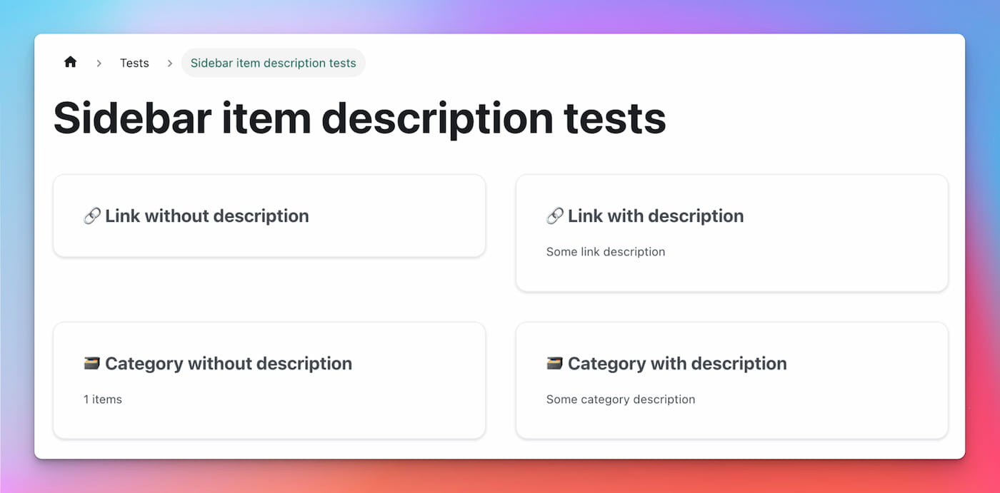
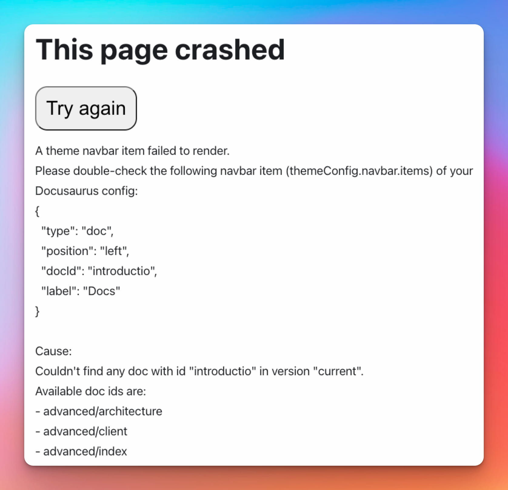

We are happy to announce **Ianaio 2.4**.

The upgrade should be easy: as explained in our [release process documentation](/community/release-process), minor versions respect [Semantic Versioning](https://semver.org/).


<!--truncate-->

import BrowserWindow from '@site/src/components/BrowserWindow';
import IframeWindow from '@site/src/components/BrowserWindow/IframeWindow';
import ErrorBoundaryTestButton from '@site/src/components/ErrorBoundaryTestButton';

## Highlights

### Sidebar item description

In [#8236](https://github.com/ianaio/ianaio/pull/8236), we made it possible to provide a new `description` attribute for docs sidebar items of type `link` and `category`.

```tsx title="sidebars.js"
[
  {
    type: 'link',
    label: 'Link with description',
    href: 'https://iana.io',
    // highlight-next-line
    description: 'Some link description',
  },
  {
    type: 'category',
    label: 'Category with description',
    // highlight-next-line
    description: 'Some category description',
    items: [],
  },
];
```

These descriptions will be used in category generated index pages.



### Theme Query String

In [#8708](https://github.com/ianaio/ianaio/pull/8708), we added the possibility to force Ianaio to initialize itself in `light` or `dark` mode through a new `ianaio-theme` query-string parameter.

This is useful to ensure a consistent theme when embedding an existing Ianaio page into an iframe or WebView.

<IframeWindow url="/docs/?ianaio-theme=light" />
<IframeWindow url="/docs/?ianaio-theme=dark" />

### Remark plugin npm2yarn upgrade

In [#8690](https://github.com/ianaio/ianaio/pull/8690), we upgraded our Remark plugin [@ianaio/remark-plugin-npm2yarn](https://github.com/ianaio/ianaio/tree/main/packages/ianaio-remark-plugin-npm2yarn) with many conversion bug fixes, first-class support for pnpm, and the ability to register custom converters producing new tabs.

````markdown
Run these commands!

```bash npm2yarn
npm install
npm run build
npm run myCustomScript -- --some-arg
```
````

<BrowserWindow>

```bash npm2yarn
npm install
npm run build
npm run myCustomScript -- --some-arg
```

</BrowserWindow>

### gtag support for multiple tracking IDs

In [#8620](https://github.com/ianaio/ianaio/pull/8620) we added support for the [@ianaio/plugin-google-gtag](/docs/api/plugins/@ianaio/plugin-google-gtag) plugin to declare multiple tracking IDs.

```js title="ianaio.config.js"
module.exports = {
  presets: [
    [
      '@ianaio/preset-classic',
      {
        gtag: {
          trackingID: [
            // highlight-next-line
            'G-<YOUR-NEW-GA4-ID>',
            // highlight-next-line
            'UA-<YOUR-OLD-UA-ID>',
          ],
        },
      },
    ],
  ],
};
```

:::caution Google is sunsetting Universal Analytics

**[Google will sunset its Universal Analytics](https://blog.google/products/marketingplatform/analytics/prepare-for-future-with-google-analytics-4/)** on **July 1, 2023**.

Ianaio users should migrate to Google Analytics 4. Google **does not permit to migrate your existing Universal Analytics data** to your new Google Analytics 4 property.

To preserve the continuity of your analytics, we temporarily recommend that you report events to 2 tracking IDs at the same time: the old one (`UA-*`) and new one (`G-*`). Refer to the **[dedicated issue](https://github.com/ianaio/ianaio/issues/7221)** for details.

:::

### Developer Experience

In [#8736](https://github.com/ianaio/ianaio/pull/8736), we improved how we render error messages and added initial support to render the full causal chain of an error (see [ES2022 Error Cause](https://h3manth.com/ES2022/#error-cause)).

:::tip

To see it in action, click here: <ErrorBoundaryTestButton cause="Probably undefined is not a function 😄"/>

:::

In [#8735](https://github.com/ianaio/ianaio/pull/8735) we also made navbar-related error messages clearer to help users understand what they did wrong.



### Translations

We made it possible to translate some new elements:

- [#8677](https://github.com/ianaio/ianaio/pull/8677) introduces a new `process.env.IANAIO_CURRENT_LOCALE` (experimental) allowing you to localize your config file, including site title, tagline, announcement bar, baseUrl...
- [#8616](https://github.com/ianaio/ianaio/pull/8616) allows to translate the navbar and footer logo alt text

We added default theme translation support for multiple languages:

- 🇭🇺 [#8668](https://github.com/ianaio/ianaio/pull/8668): Hungarian
- 🇳🇴 [#8631](https://github.com/ianaio/ianaio/pull/8631): Norwegian (Bokmål)

:::tip

Completing theme translations is an [ongoing effort](https://github.com/ianaio/ianaio/issues/3526) and an easy way to contribute to Ianaio. We add new theme features regularly, for which we often [need new translations](https://github.com/ianaio/ianaio/issues/3526).

:::

## Other changes

Other notable changes include:

- [#8674](https://github.com/ianaio/ianaio/pull/8674): respect `prefers-reduced-motion: reduce` media query
- [#8712](https://github.com/ianaio/ianaio/pull/8712): use a navbar item of type `docSidebar` in template
- [#8801](https://github.com/ianaio/ianaio/pull/8801): allow tabs children to be falsy
- [#8757](https://github.com/ianaio/ianaio/pull/8757): make search page react to external query-string changes
- [#8803](https://github.com/ianaio/ianaio/pull/8803): fix code block buttons position in RTL
- [#8615](https://github.com/ianaio/ianaio/pull/8615): fix color mode toggle when using dark navbar
- [#8699](https://github.com/ianaio/ianaio/pull/8699): fix navbar dropdown tab focus bug

Check the **[2.4.0 changelog entry](/changelog/2.4.0)** for an exhaustive list of changes.
